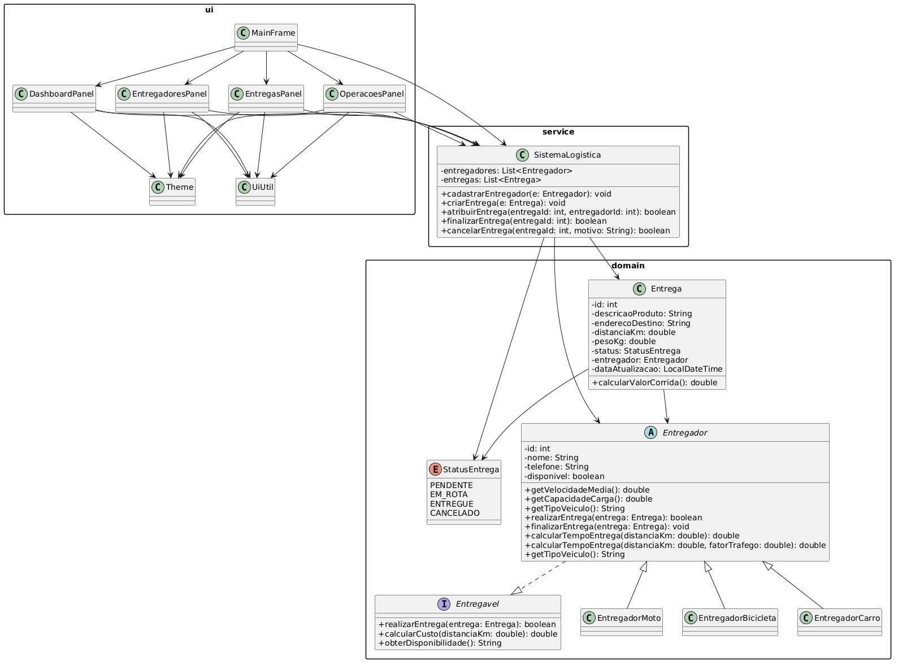

**FIAP · 2ESPZ · 2026 · Domain Driven Design — CP2**

- Camila de Mendonça Silva - RM: 565491
- Julia Cabral Cruz - RM: 565583
- Julia Silva Santos - RM: 564670
- Luana Luo - RM: 562271
- Sidyellen Souza - RM: 566408

---

## Como executar no IntelliJ IDEA

1. Abra o IntelliJ → **File > Open** → selecione a pasta `logistica-cp2/`
2. Clique com botão direito na pasta `src/` → **Mark Directory as > Sources Root**
3. Vá em **Run > Run 'Main'** (ou use `Shift+F10`)

> **Requisitos:** Java 17+ com Swing (JDK completo, não headless)

---

## Estrutura do Projeto

```
src/
├── Main.java                        ← Ponto de entrada (SwingUtilities.invokeLater)
├── domain/
│   ├── Entregavel.java              ← Interface (comportamento de entrega)
│   ├── StatusEntrega.java           ← Enum de status
│   ├── Entregador.java              ← Classe abstrata
│   ├── EntregadorMoto.java          ← Subclasse concreta
│   ├── EntregadorBicicleta.java     ← Subclasse concreta
│   ├── EntregadorCarro.java         ← Subclasse concreta
│   └── Entrega.java                 ← Entidade de entrega/pedido
├── service/
│   └── SistemaLogistica.java        ← Regras de negócio e gerenciamento
└── ui/
    ├── Theme.java                   ← Constantes visuais (cores, fontes)
    ├── UiUtil.java                  ← Componentes Swing reutilizáveis
    ├── MainFrame.java               ← Janela principal com CardLayout
    ├── DashboardPanel.java          ← Painel de estatísticas
    ├── EntregadoresPanel.java       ← CRUD de entregadores
    ├── EntregasPanel.java           ← CRUD de entregas
    └── OperacoesPanel.java          ← Atribuição/finalização/cancelamento
```

---

## Diagrama de Classes UML

O diagrama abaixo representa a modelagem do domínio do sistema, evidenciando o uso de **herança**, **interfaces** e **classe abstrata**, conforme os princípios de Domain Driven Design.



---

## Perguntas Discursivas

### 1. Herança

A herança foi utilizada para modelar os diferentes tipos de entregadores do sistema.  
A classe abstrata **Entregador** concentra atributos e comportamentos comuns, como nome, telefone, disponibilidade e métodos relacionados à realização de entregas.

As classes **EntregadorMoto**, **EntregadorBicicleta** e **EntregadorCarro** herdam de **Entregador**, especializando seu comportamento ao definir valores diferentes para velocidade média, capacidade de carga e custo por quilômetro.

Isso resolveu o problema de **repetição de código** e permitiu o **tratamento polimórfico** dos entregadores, tornando o sistema mais flexível e fácil de manter.

---

### 2. Interfaces

A interface **Entregavel** foi criada para definir um contrato comum para qualquer entidade que possa realizar uma entrega.

Ela define métodos como:
- `realizarEntrega`
- `calcularCusto`
- `obterDisponibilidade`

A utilização da interface trouxe como vantagem o **baixo acoplamento**, permitindo que diferentes tipos de entregadores implementem a mesma lógica de entrega, respeitando um contrato comum. Além disso, a interface facilita futuras extensões do sistema, como a inclusão de novos tipos de entregadores sem impactar o restante da aplicação.

---

### 3. Classe Abstrata

A classe abstrata **Entregador** tem o papel de representar um entregador genérico, reunindo atributos e comportamentos compartilhados por todos os tipos de entregadores do sistema.

Ela não poderia ser uma classe comum porque **não faz sentido instanciar um entregador genérico**, sem um tipo de veículo definido. Além disso, ela declara métodos abstratos, como `getVelocidadeMedia` e `getCapacidadeCarga`, que **obrigam** as subclasses a fornecerem suas próprias implementações.

Esse uso garante consistência, reutilização de código e aplicação correta do conceito de herança no domínio do sistema.